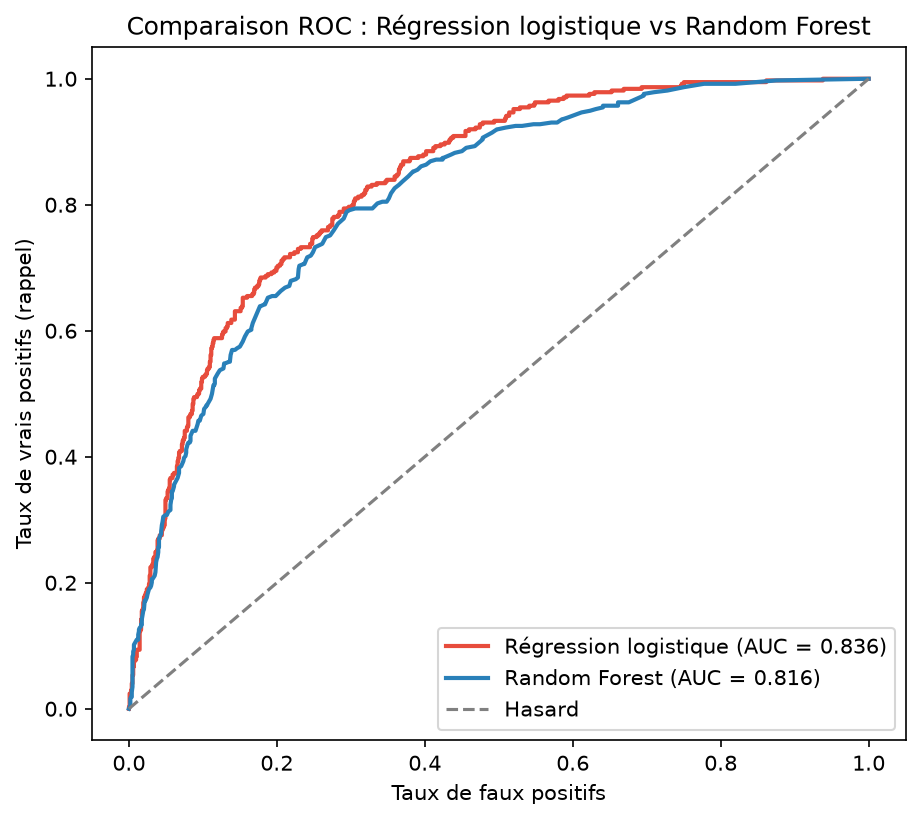
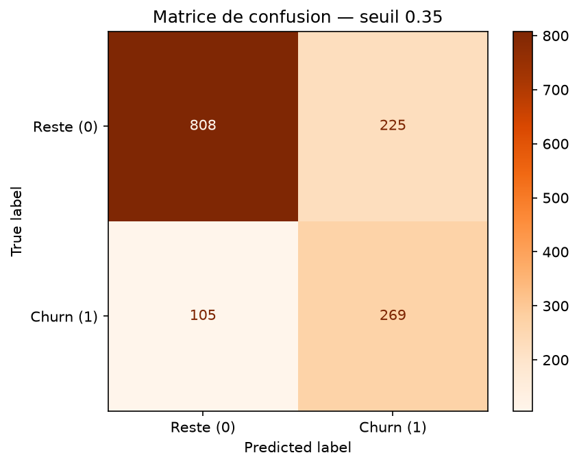

# Telco Churn Pipeline — Prédiction de la résiliation client

Pipeline de Data Science **end-to-end** pour prédire la résiliation (*churn*) de clients télécom à partir de données réelles : de l'exploration des données jusqu'à la modélisation, l'évaluation et la comparaison de modèles.

**Stack :** Python · Pandas · scikit-learn · matplotlib · seaborn

---

## Objectif métier

Retenir un client coûte moins cher que d'en acquérir un nouveau. L'objectif est de **détecter en amont les clients à risque de départ** pour permettre des actions de rétention ciblées. La priorité n'est donc pas la précision brute, mais la capacité à **repérer un maximum de partants réels** (le *rappel*).

## Données

Dataset **Telco Customer Churn** (IBM), ~7 000 clients, 21 variables : données démographiques, services souscrits, type de contrat, facturation, et la cible `Churn` (Yes/No).

> Le dataset n'est pas versionné dans ce dépôt. Pour le récupérer :
> ```bash
> wget -O data/telco_churn.csv https://raw.githubusercontent.com/IBM/telco-customer-churn-on-icp4d/master/data/Telco-Customer-Churn.csv
> ```

## Résultats clés

| Modèle | AUC | Rappel (Churn) | F1 (Churn) |
|---|---|---|---|
| **Régression logistique** (retenu) | **0,836** | 0,57 | 0,61 |
| Random Forest | 0,816 | 0,49 | 0,55 |

Après **ajustement du seuil de décision** (0,50 → 0,35), le rappel de la classe *churn* passe de **57 % à 72 %** : le modèle détecte près de 3 partants sur 4, au prix d'une précision plus faible — un arbitrage assumé au regard du coût métier.

### Comparaison des modèles (courbe ROC)



Contre-intuitivement, la **régression logistique surpasse le Random Forest**. Le problème de churn étant largement linéaire, la complexité supplémentaire n'apporte aucun gain — et le modèle simple a l'avantage d'être **interprétable**, ce qui facilite l'explication des facteurs de départ au métier.

### Matrice de confusion (seuil 0,35)



## Principaux enseignements de l'exploration (EDA)

- **Déséquilibre des classes** : 26,6 % de churn. L'accuracy seule est donc trompeuse (un modèle naïf « personne ne part » atteint déjà 73 %) — d'où le choix du rappel et de l'AUC comme métriques de référence.
- **Type de contrat** : facteur le plus discriminant — 42,7 % de churn en contrat mensuel contre 2,8 % en engagement 2 ans.
- **Ancienneté** : les partants ont en moyenne 18 mois d'ancienneté contre 38 pour les fidèles. Le risque de départ se concentre sur les premiers mois.

## Démarche technique

1. **Nettoyage** — conversion de `TotalCharges` (stockée en texte à cause de valeurs vides), suppression de 11 lignes sans historique de facturation (clients à ancienneté nulle), retrait de l'identifiant non prédictif.
2. **Feature engineering** — `ColumnTransformer` combinant mise à l'échelle (`StandardScaler`) des variables numériques et encodage *one-hot* des catégorielles. Split train/test **stratifié** pour préserver la proportion de churn.
3. **Modélisation** — `Pipeline` scikit-learn intégrant préparation et modèle, ce qui **garantit l'absence de fuite de données** (les transformations sont apprises sur le train uniquement).
4. **Évaluation** — matrice de confusion, précision/rappel/F1, courbe ROC-AUC, et analyse de l'ajustement du seuil.
5. **Comparaison** — régression logistique vs Random Forest sur un protocole identique.

## Structure du projet

```
telco-churn-pipeline/
├── data/                      # dataset (non versionné)
├── notebooks/
│   └── 01_narrative_eda.ipynb # exploration racontée
├── src/
│   ├── clean.py               # chargement + nettoyage
│   ├── features.py            # split stratifié + ColumnTransformer
│   ├── train.py               # Pipeline + régression logistique
│   ├── evaluate.py            # métriques, matrice de confusion, ROC, seuil
│   └── compare_models.py      # comparaison des deux modèles
├── reports/figures/           # graphiques générés
├── requirements.txt
└── README.md
```

## Reproduire les résultats

```bash
# 1. Environnement
python3 -m venv venv
source venv/bin/activate
pip install -r requirements.txt

# 2. Récupérer les données (voir section Données)

# 3. Lancer le pipeline
python src/evaluate.py         # entraînement + évaluation complète
python src/compare_models.py   # comparaison des modèles
```

## Pistes d'amélioration

- Calibration du seuil à partir d'une matrice de coûts métier réelle (coût d'un client perdu vs coût d'une action de rétention).
- Test de techniques de rééquilibrage (class weights, SMOTE).
- Analyse de l'importance des variables pour affiner les leviers de rétention.
